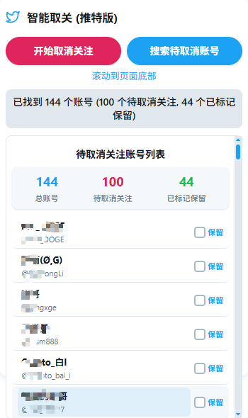

# Smart Unfollow for Twitter / 智能取关 (推特版)

<!-- Optional: Add badges here -->
<!-- [![Version][version-shield]][version-url] -->
[![License: GPL v3][license-shield]][license-url]

一款 Chrome 扩展程序，旨在帮助用户更智能地管理他们的 Twitter/X 关注列表。它允许你预览关注列表，选择想要保留的账号，然后批量取消关注其余**未关注你且**未标记保留的账号。

## ⚠️ 重要：风险提示与免责声明

**请在使用本扩展前仔细阅读并理解以下内容：**

*   **用户风险自负**: 使用自动化工具操作社交媒体账号本身存在风险。虽然本扩展试图模拟人类行为并包含速率限制保护，但**无法完全保证避免 Twitter/X 官方的检测或处罚**。**使用本扩展可能导致你的账号被限制、暂时封禁甚至永久封禁。所有风险由使用者自行承担。**
*   **误操作风险**: 在"审核与选择"步骤中，请务必仔细检查标记为"保留"的账号。**任何因用户配置失误或未仔细检查而导致的错误取消关注，责任由使用者承担。**
*   **无保证**: 本扩展按"原样"提供，不提供任何形式的明示或暗示担保，包括但不限于对适销性、特定用途适用性和不侵权的担保。
*   **开发者免责**: **对于因使用或无法使用本扩展而导致的任何直接或间接损失（包括但不限于数据丢失、利润损失、业务中断、账号损失等），开发者（即本仓库的所有者/贡献者）概不负责。**
*   **依赖性**: 本扩展依赖于 Twitter/X 的网站结构。如果 Twitter/X 更新其界面，本扩展可能失效，需要更新才能继续使用。

**继续安装和使用本扩展，即表示你已阅读、理解并同意承担上述所有风险，并同意免除开发者的一切责任。**

 <!-- 请将 preview.png 替换为你的预览图片 -->

## ✨ 功能特性

*   **智能筛选与预览**:
    *   自动加载你的关注列表。
    *   **核心功能**: 在你的关注列表中，识别出那些**没有显示"关注了你" (Follows you)** 标识的账号，并将它们作为待取消关注的初步候选列表。
    *   在 Twitter 页面上直观地高亮显示这些待取消关注的账号（默认排除你标记为保留的账号）。
    *   在扩展弹出窗口中提供清晰的账号列表预览。
*   **无需授权，保护隐私**:
    *   本扩展**不需要**你的 Twitter/X 账号授权、登录信息或 API 密钥。
    *   所有分析和操作都在你**当前打开的浏览器页面**上本地执行。
    *   通过分析页面上的公开元素（如"关注了你"标识）来识别账号关系，不涉及后台数据传输或存储你的个人敏感信息。
*   **用户自定义保留**:
    *   允许用户在预览列表中勾选想要"保留"的账号。
    *   扩展在执行取消关注任务时会自动跳过这些标记为"保留"的账号。
    *   保留列表会自动保存，并在下次预览时生效。
*   **批量处理与效率**:
    *   分批次执行取消关注操作，避免一次性请求过多导致的问题。
    *   采用优化的查找和滚动机制，以高效处理关注列表。
*   **速率限制保护**:
    *   内置延迟机制，模拟正常用户操作。
    *   自动检测 Twitter 的速率限制（rate limit），并在触发时暂停任务，等待一段时间后自动恢复，以保护你的账号安全。
*   **进度跟踪与状态持久化**:
    *   实时显示任务进度，包括已找到的账号总数、已取消关注的数量以及已用时间。
    *   即使你关闭了扩展的弹出窗口，任务状态（包括待处理列表和进度）也会被保存，方便后续继续或查看。
*   **可视化高亮**:
    *   当预览列表加载后，扩展会在 Twitter/X 的关注列表页面上，用黄色背景高亮显示那些在待取消关注列表中的账号，方便你直观地识别。
*   **速度模式调整 (需修改代码)**:
    *   可以通过**直接修改 `unfollow.js` 文件中的 `config` 对象**来调整内部参数（如滚动延迟、步长等），以适应不同的网络环境或操作偏好。**注意：这需要一定的代码修改能力。**
*   **确认机制**:
    *   在正式开始取消关注操作前，会弹出一个确认对话框，列出将要取消关注的账号数量。
    *   提供"下次自动确认"选项，方便用户跳过重复确认。
*   **简洁的用户界面**:
    *   提供清晰直观的弹出窗口界面，方便用户启动任务、预览列表、标记保留以及监控进度。

## 🚀 安装

1.  **下载**: 克隆或下载此仓库的代码到你的本地计算机。
2.  **加载扩展**:
    *   打开 Chrome 浏览器。
    *   在地址栏输入 `chrome://extensions/` 并访问。
    *   在页面右上角，打开"**开发者模式**"开关。
    *   点击左上角的"**加载已解压的扩展程序**"按钮。
    *   在弹出的文件选择框中，选择你刚刚下载并解压的扩展程序文件夹。
3.  **图标**: 确保扩展文件夹中包含 `icon16.png`, `icon48.png`, `icon128.png` 图标文件，以便在浏览器中正确显示。

## 🎯 使用方法

1.  **导航**: 打开你的 Twitter/X 页面，并导航到以下任一页面：
    *   你的**个人资料页** (`https://twitter.com/你的用户名` 或 `https://x.com/你的用户名`)
    *   你的**关注列表页** (`https://twitter.com/你的用户名/following` 或 `https://x.com/你的用户名/following`)
2.  **打开扩展**: 点击浏览器工具栏上的扩展图标，打开弹出窗口。
3.  **（重要）预览账号**:
    *   点击"**搜索待取消账号**"按钮。
    *   扩展将开始加载你的关注列表，识别那些**未关注你**的账号，并在弹出窗口中显示。同时，页面上对应的待取关账号会被高亮显示。
    *   请耐心等待加载完成，加载时间取决于你的关注数量。你可以通过点击页面底部的"滚动到页面底部"链接来辅助加载（如果需要）。
4.  **审核与选择**:
    *   在扩展弹出窗口的列表中，仔细检查账号。
    *   对于你**不想**取消关注的账号（即使他们没有关注你），请勾选其右侧的"**保留**"复选框。你的选择会自动保存。
    *   **检查受限账号**: 点击列表中的用户名可以跳转到该用户的 Twitter/X 主页。如果发现某个账号主页显示"**警告：此账号暂时受限**" (Warning: This account is temporarily restricted) 或类似信息，即使它当前没有显示"关注了你"，也**建议先将其标记为"保留"**。因为受限状态可能导致"关注了你"标识暂时不显示。你可以在该账号解除限制后再进行检查。
5.  **开始任务**:
    *   确认列表无误后，点击"**开始取消关注**"按钮。
    *   扩展会弹出一个确认对话框（除非你之前选择了自动确认）。
    *   确认后，扩展将开始在后台自动取消关注那些**未被标记为保留**的账号（每次最多处理 100 个）。
6.  **监控进度**:
    *   弹出窗口会实时显示进度条、已取消关注的数量和已用时间。
    *   如果遇到速率限制，状态栏会提示并自动暂停。
7.  **控制**:
    *   你可以随时点击"**停止**"按钮来中止任务。
    *   任务进度会自动保存。如果任务中断（例如关闭浏览器或遇到错误），下次打开扩展时，通常可以从上次的状态继续（具体取决于中断时的状态）。
8.  **关于跳过账号**: 为了平衡处理速度和稳定性，扩展在执行取消关注的过程中，有时可能会**跳过**少数符合条件的账号（例如，页面加载延迟或元素未能及时找到）。这属于正常现象。如果发现有账号被遗漏，你可以在当前任务完成后，**重新执行一次"搜索待取消账号"和"开始取消关注"**来处理这些被跳过的账号。

## ⚙️ 技术细节

*   **账号获取与筛选**: 通过在内容脚本 (`unfollow.js`) 中执行 `getFollowingList` 函数，模拟页面滚动来动态加载和解析关注列表中的用户信息，并**检查每个用户卡片是否包含"关注了你" (Follows you) 的标识**来初步筛选。
*   **用户选择与存储**: 使用 `chrome.storage.local` API 来持久化存储用户标记的"保留列表" (`keepList`) 和预览的账号列表 (`previewAccounts`)。**不存储用户凭据或敏感信息。**
*   **取消关注逻辑**: 在内容脚本 (`unfollow.js`) 中执行 `unfollowSelectedAccounts` 函数，该函数负责：
    *   查找页面上对应的账号元素。
    *   模拟点击"正在关注"按钮。
    *   处理并点击确认取消关注的对话框。
    *   分批次处理，并在操作之间加入延迟。
*   **状态管理**: 任务的运行状态 (`isRunning`)、当前进度 (`progress`) 以及待处理的账号列表 (`unfollowTask` 或 `unfollowList`) 也保存在 `chrome.storage.local` 中，以实现持久化和后台运行。
*   **速率限制处理**: 通过监控操作反馈（例如按钮状态未按预期变化或特定错误）来判断是否触发速率限制，并在 `handleRateLimit` 函数中实现暂停逻辑。
*   **高亮显示**: 利用 `IntersectionObserver` 监测账号元素是否进入视口，并结合 `MutationObserver` 监测 DOM 变化（如新加载的账号），动态地为待取消关注的账号应用或移除高亮样式 (`highlightColor`)。高亮逻辑由 `initializeHighlighting` 和 `applyHighlight` 等函数管理。

## 🔧 故障排除

*   **进度不更新**: 尝试关闭并重新打开扩展弹出窗口。
*   **提示速率限制**: 扩展会自动暂停并稍后尝试恢复。这是正常现象，请耐心等待。
*   **任务提前停止**: 可能是 Twitter/X 的界面发生了变化，或者网络连接不稳定。尝试刷新页面后重试。
*   **无法开始任务/预览**: 确保你当前所在的页面是你的 Twitter/X 个人资料页或关注列表页。

## 🤝 贡献

欢迎各种形式的贡献！包括但不限于：
*   提交问题 (Issues)
*   创建拉取请求 (Pull Requests)
*   提出功能建议
*   报告 Bug

## 📜 开源许可

本项目采用 **GNU General Public License v3.0 (GPLv3)** 开源。
这意味着你可以自由地使用、修改和分发此软件，但**任何修改或衍生版本也必须以 GPLv3 协议开源，并且不允许将此代码用于闭源商业项目或进行销售牟利**。
详情请见 [LICENSE](LICENSE) 文件（你需要添加一个包含 GPLv3 文本的 LICENSE 文件）。

<!-- Markdown link & img dfn's -->
[preview-shield]: https://img.shields.io/badge/Preview-%F0%9F%96%BC%EF%B8%8F-blue?style=flat-square
[preview-url]: preview.png
<!-- [version-shield]: https://img.shields.io/github/package-json/v/YOUR_USERNAME/YOUR_REPO_NAME?style=flat-square -->
<!-- [version-url]: https://github.com/YOUR_USERNAME/YOUR_REPO_NAME/releases -->
[license-shield]: https://img.shields.io/badge/License-GPLv3-blue.svg?style=flat-square
[license-url]: https://www.gnu.org/licenses/gpl-3.0